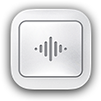

# Trackpad Haptics — Adobe Photoshop UXP Plugin

<div align="center">



# Trackpad Haptics for Photoshop
**Tactile, physical feedback for Adobe Photoshop powered by macOS Force Touch Trackpads.**

[%20--%202025+-31A8FF?style=flat-square&logo=adobephotoshop&logoColor=white)](https://www.adobe.com/products/photoshop.html)
[-000000?style=flat-square&logo=apple&logoColor=white)](https://apps.apple.com/in/app/trackpad-haptics/id6780054447?mt=12)
[](https://developer.adobe.com/photoshop/uxp/)
[](https://apps.apple.com/in/app/trackpad-haptics/id6780054447?mt=12)
[](LICENSE)

[Download Native Mac Companion App](https://apps.apple.com/in/app/trackpad-haptics/id6780054447?mt=12) • [Installation](#-installation) • [How It Works](#-architecture--how-it-works) • [Features](#-key-features)

</div>

---

## 📖 Overview

**Trackpad Haptics for Photoshop** brings real, tactile sensations to your creative workflow. When zooming into details, rotating the canvas, or aligning layers against smart guides, your MacBook or Magic Trackpad physically clicks and pulses under your fingers.

This plugin is powered by the **[Trackpad Haptics Native macOS App](https://apps.apple.com/in/app/trackpad-haptics/id6780054447?mt=12)** via an ultra-low-latency local bridge.

---

## ✨ Key Features

| Feature | Interaction | Haptic Sensation |
| :--- | :--- | :--- |
| **🔍 Pinch-to-Zoom** | Two-finger pinch gesture on canvas | Real-time modulated clicks responding to zoom rate (20fps zero-lag sampling) |
| **⚡ Layer & Guide Snap** | Dragging layers near canvas edges, centers, or guides | Crisp, distinct tactile snap pulses when snapping into position |
| **📐 Smart Guides Alignment** | Aligning layers with neighboring elements | Physical click confirming alignment with pink smart guides |
| **🔄 Canvas Rotation** | Two-finger rotate gesture *(Companion app)* | Step pulses with firm detents at 0°, 90°, 180°, and 270° |
| **🎛️ Skeuomorphic Panel** | Dedicated Photoshop panel | Real-time event monitor dots, master toggle, and auto-reconnecting status |

---

## 🏗️ Architecture & How It Works

```
┌────────────────────────────────────────────────────────┐
│               Adobe Photoshop (UXP Panel)              │
│                                                        │
│   • 20fps Zero-Lag Canvas Zoom Polling                 │
│   • Action Listeners (move, align, guide, transform)   │
│   • Canvas Geometry & Boundary Calculations            │
└──────────────────────────┬─────────────────────────────┘
                           │
                           │ WebSocket (ws://localhost:9006)
                           ▼
┌────────────────────────────────────────────────────────┐
│        Trackpad Haptics (Native macOS Companion)       │
│                                                        │
│   • High-precision haptic scheduler                    │
│   • Velocity & cadence dampening                       │
│   • Direct Apple Multitouch / Force Touch Engine       │
└──────────────────────────┬─────────────────────────────┘
                           │
                           │ NSHapticFeedbackManager / Actuator
                           ▼
┌────────────────────────────────────────────────────────┐
│     MacBook Force Touch Trackpad / Magic Trackpad      │
└────────────────────────────────────────────────────────┘
```

1. **UXP Event Detection**: The plugin listens to Photoshop's internal action notifications (`move`, `nudge`, `align`, `distribute`, `transform`, `guide`, `select`) and monitors the active document zoom state at 50ms intervals.
2. **Local Bridge**: Events are instantly streamed over a high-speed local WebSocket (`ws://localhost:9006`) to the native Trackpad Haptics macOS app.
3. **Tactile Actuation**: The native app fires precise hardware actuation pulses directly to your Force Touch trackpad.

---

## 🚀 Installation

> [!NOTE]
> **Prerequisite:** Make sure the **[Trackpad Haptics](https://apps.apple.com/in/app/trackpad-haptics/id6780054447?mt=12)** macOS app is installed and running on your Mac.

You do **not** need the Adobe UXP Developer Tool. Choose any of these easy methods:

### Option 1: 1-Click Auto Install *(Recommended)*
1. Open the **Trackpad Haptics** macOS app.
2. Go to the **Photoshop** tab in the sidebar.
3. Click the blue **"⚡ 1-Click Auto Install to Photoshop"** button.
4. Launch or restart Adobe Photoshop. Find the panel under **Plugins → Trackpad Haptics**.

---

### Option 2: Double-Click the `.ccx` Package
1. Double-click the pre-built [`TrackpadHaptics.ccx`](TrackpadHaptics.ccx) file in this repository.
2. The **Adobe Creative Cloud Desktop** installer will open automatically.
3. Click **Install**.
4. Launch Photoshop and open **Plugins → Trackpad Haptics**.

---

### Option 3: Terminal Installer Script
Run the automated installer script directly from Terminal:
```bash
git clone https://github.com/<your-username>/<your-repo-name>.git
cd <your-repo-name>
chmod +x install.sh
./install.sh
```
The script automatically:
- Builds a clean `TrackpadHaptics.ccx` bundle
- Deploys the plugin to Adobe's UXP External plugin directories
- Syncs via Adobe Unified Plugin Installer Agent (`UPIA`)
- Installs directly into all detected `/Applications/Adobe Photoshop 20XX/Plug-ins/` folders

---

### Option 4: Manual Installation
1. Copy this entire repository folder.
2. Open Finder and press `Cmd + Shift + G`, then go to:
   ```
   /Applications/Adobe Photoshop 2025/Plug-ins/
   ```
   *(Or your corresponding Photoshop version)*
3. Paste the folder and rename it to `TrackpadHaptics`.
4. Restart Adobe Photoshop.

---

### Option 5: Adobe UXP Developer Tool (For Developers)
1. Open **Adobe UXP Developer Tool**.
2. Click **Add Plugin** and select `manifest.json` from this folder.
3. Select your installed version of Photoshop and click **Load**.

---

## 🖥️ Using the Plugin

1. In Adobe Photoshop, navigate to the top menu: **Plugins → Trackpad Haptics**.
2. Dock the compact panel anywhere in your workspace (recommended next to the *Layers* or *History* panel).
3. Check the connection indicator:
   - 🟢 **Connected**: Active and communicating with the native app on `localhost:9006`.
   - 🔴 **Disconnected**: Click **Reconnect** or ensure the macOS host app is open.
4. **Test Feedback**:
   - Click the **Pinch to zoom** row to test the zoom haptic click.
   - Click the **Layer & Guide Snap** row to test the snap haptic pulse.
5. Use the top-right **master switch** anytime to pause or resume haptics on demand.

---

## 📁 Repository Structure

```
├── README.md               # Documentation and guides
├── manifest.json           # Adobe UXP v5 manifest
├── index.html              # Plugin UI structure
├── styles.css              # Dark-mode native Photoshop styling
├── index.js                # Core event listeners & WebSocket bridge
├── install.sh              # 1-click terminal installation script
├── TrackpadHaptics.ccx     # Pre-packaged Creative Cloud installer
└── assets/                 # Icons, toggle components, and indicators
    ├── AppIcon.png
    ├── EventFire_BG.png
    ├── EventFire_Front.png
    ├── Layer_Snap_Icon.png
    ├── Magnifying_Glass_Icon.png
    ├── Reconnect_Icon.png
    └── ...
```

---

## 🔧 Technical Details

- **Host Requirements**: Adobe Photoshop 2022 (v23.0.0) or newer (Apple Silicon & Intel)
- **Manifest Version**: UXP Manifest v5
- **Socket Port**: `ws://localhost:9006`
- **Network Permissions**: Required permissions for `localhost` and `127.0.0.1` defined in `manifest.json`
- **Zero-Lag Zoom**: Non-blocking `doc.zoom` sampling at 50ms (20fps) with differential delta filtering
- **Snap Cooldown**: 100ms debouncing to prevent audio/haptic distortion during rapid layer movements

---

## 🤝 Native macOS App

This plugin requires the native macOS host application to trigger trackpad haptics via Apple's haptic engine:

👉 **[Download Trackpad Haptics on the Mac App Store](https://apps.apple.com/in/app/trackpad-haptics/id6780054447?mt=12)**

---

## 📄 License

This project is licensed under the [MIT License](LICENSE) — feel free to contribute and build upon it.
